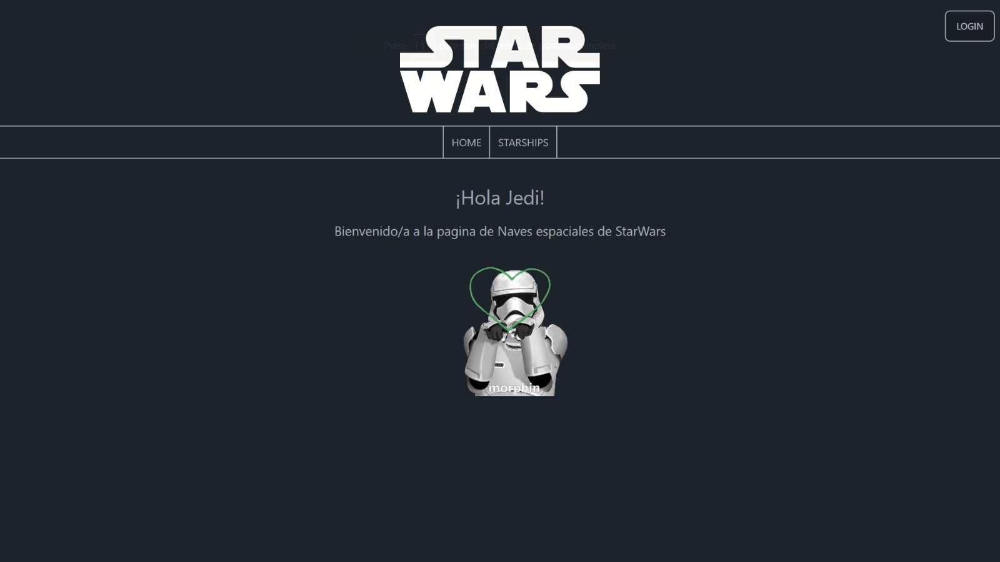

# App Star Wars

## Ejercicio realizado durante mi foramción en It Academy

### Tecnologias utilizadas
- Typescript
- Reactjs 
- React Router + React Router Dom
- Tailwind + Daisy UI
- Firebase
- Zustand

